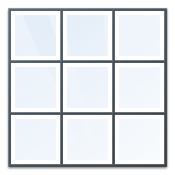

# CarreMagique
- Create Magic Square Solution Using Delphi
                                            - ( Dimension : 4/4)                     
 

# Features  
- Auto Solve Magic square Problem . 

## Files

| File | Contents | 
| --- | --- |
| .gitignore | Git ignores the files in this file |
| uAbout.pas | About view of the programme |
| Main.pas | Main view of the programme |
| uCarreM.pas| Unit Tools of the programme |
| CarreMagique.dpk | The compiler project file |
| CarreMagique.dproj | The MSBUILD project file |
| README.md | The readme for this project |
