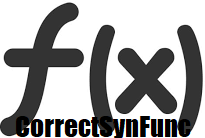

# CoorectSynFunc
- Auto correct function syntax.    

 

# View
- CorrectSynfunc :

# Features  

- Detect error in function syntax.

## Files

| File | Contents | 
| --- | --- |
| .gitignore | Git ignores the files in this file |
| AboutSN.pas | Information view of the programme |
| uValidParantheses.pas.pas | The main view of the programme |
| CoorectSynFunc.dpk | The compiler project file |
| CoorectSynFunc.dproj | The MSBUILD project file |
| README.md | The readme for this project |
