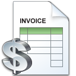

# ProfitWTrans
- Calculate Max Profit With x Numbers of Transactions Using Delphi.
                                                              
 

# Features  
- Calculate The Maximum Profit. 

## Files

| File | Contents | 
| --- | --- |
| .gitignore | Git ignores the files in this file |
| uAbout.pas | About view of the programme |
| Main.pas | Main view of the programme |
| ProfitWTrans.dpk | The compiler project file |
| ProfitWTrans.dproj | The MSBUILD project file |
| README.md | The readme for this project |

## To Install the Software: