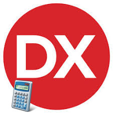

# Delphi-Collection-Math
My Own Delphi-Collection ( Math ) 

**Authors:**  *WalWalWalides*
------

## Contains

| File | Contents | 
| --- | --- |
| .gitignore | Git ignores the Files in this File |
|[CarreMagique](https://github.com/walwalwalides/Delphi-Collection-Math/tree/master/CarreMagique)| Create Magic Square Solution Using Delphi 
|[CalculSum](https://github.com/walwalwalides/Delphi-Collection-Math/tree/master/CalculSum)| A simpler Way To Write Addition Operations Using Object Oriented Programming (OOPs)
|[ProfitWTrans](https://github.com/walwalwalides/Delphi-Collection-Math/tree/master/ProfitWTrans)|Calculate Max Profit With x Numbers of Transactions Using Delphi.
|[DrawTree](https://github.com/walwalwalides/Delphi-Collection-Math/tree/master/DrawTree)|A Simple Way To Draw a Tree.
| README.md | The Readme for this Project|

------

# If You Want To Donate!

